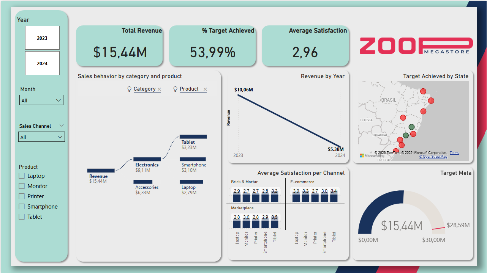
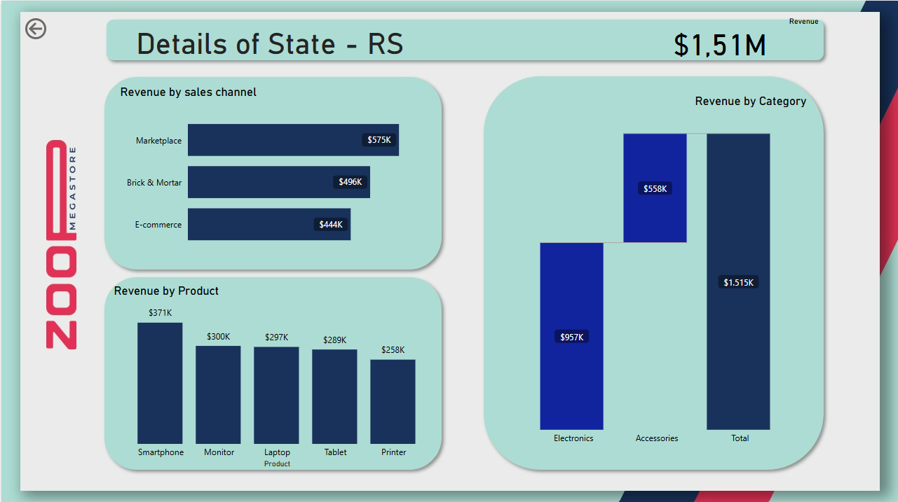
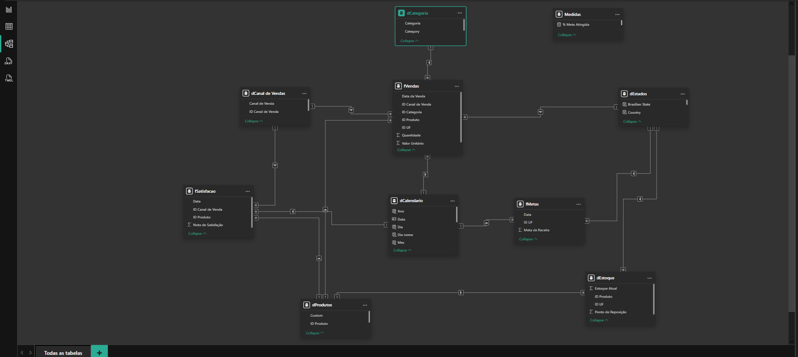

# 📊 Executive Sales & Retail Analytics Dashboard (Zoop Megastore)

A high-end, interactive Power BI business intelligence solution designed for global retail and e-commerce analytics. This project features a polished UI/UX structure, context-aware navigation, and strict data localization standards suited for international enterprise reporting.

---

## 🖥️ Live Report Previews

<p align="center">
  <strong>Main Sales Performance Report</strong><br>
  
</p>

<br>

<p align="center">
  <strong>State-Level Drill-Through Analytics Page</strong><br>
  
</p>

---

## 🎯 Key Business Insights & Features

* **High-Level KPI Tracking:** Instant visibility over **Total Revenue**, **% Target Achieved**, and **Average Customer Satisfaction** using custom glassmorphism visual containers.
* **Advanced Data Storytelling:** * Integrated a **Decomposition Tree** visual allowing stakeholders to dynamically break down sales behavior by Category and Product levels.
  * Utilized custom **Gauge charts** and geospatial mapping to track actual vs. target performance across multiple locations.
* **Seamless UX Navigation:** Configured cross-report **Drill-Through mechanics** allowing users to right-click geographic regions on the main report and access a tailored granular layout for that specific state.

---

## ⚙️ Technical Architecture & Modeling

### 🔗 Robust Star Schema Modeling
The backend data architecture is built strictly on a **Star Schema design**, separating transactional fact tables from master dimension tables to maximize performance and ensure accurate filter propagation.

<p align="center">
  
</p>

* **Fact Tables:** `fVendas`, `fMetas`, `fSatisfacao`.
* **Dimension Tables:** `dProdutos`, `dCategoria`, `dCanal de Vendas`, `dEstados`, `dEstoque`.
* **Dedicated Calendar Dimension (`dCalendario`):** Implemented a standardized Date Dimension table containing custom attributes (`Ano`, `Mes`, `Dia`, `Dia nome`). This ensures high-performance Time Intelligence calculations (YTD, MoM analysis) and guarantees zero data gaps across different transactional fact models.

### 🛠️ Advanced Implementations:
* **Context-Aware Dynamic Titles (DAX):** Developed custom measures using `SELECTEDVALUE` to dynamically update section headers depending on user filtering (e.g., automatically displaying *"Details of State - RS"* without hardcoded text blocks).
* **Data Transformation & Localization (Power Query):** Mapped and localized original regional source data into standardized global terminology (e.g., establishing `Brick & Mortar` categories) and enforced international US numbering and currency formatting standards (`$M` / `$K`).

---

## 📂 Repository Structure

```text
├── Data Sources/               # Raw Excel/CSV files used for the project
├── Zoop_Megastore_Report.pbix  # Main Power BI project file
├── images/                     # Screenshots used in this README documentation
└── README.md                   # Project description and documentation
